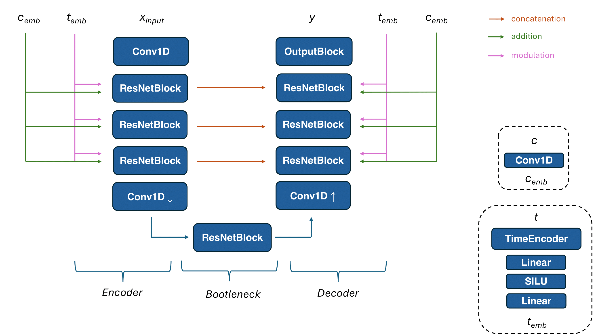
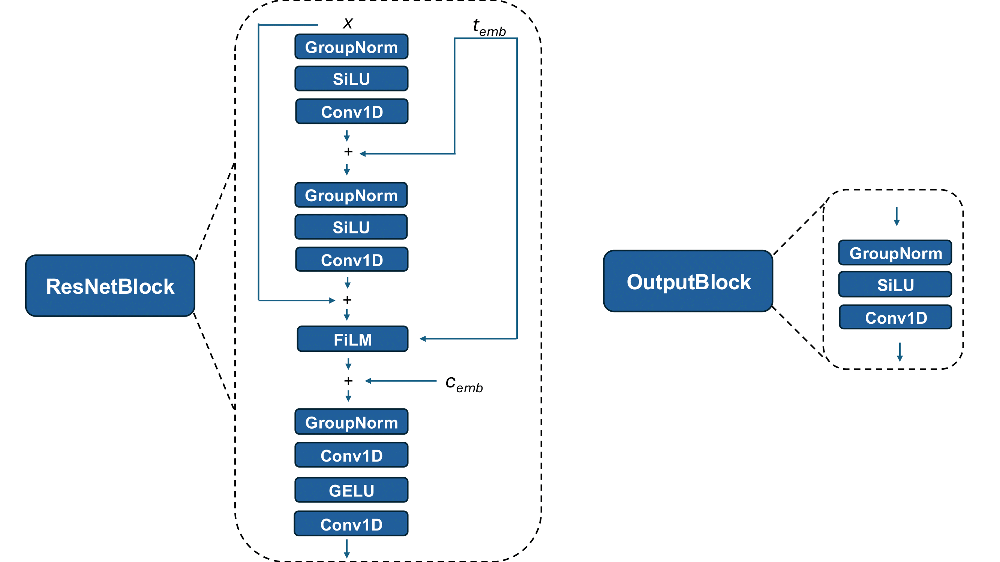

# Low-Latency Diffusion-based Audio Synthesizer

This code repository is for the article _Low-Latency Diffusion-based Audio Synthesizer_, in review.

This repository contains all the necessary utilities to use our architectures. Find the code located inside the "./src" folder, and the weights of pre-trained models inside the "./weights" folder

### Folder Structure

```
./
├── src
├── evaluation
├── plots
└── weights
    ├── 512
    ├── 1024
    ├── 2048
    └── 4096
        
```

### Contents

1. [Datasets](#datasets)
2. [Architecture](#architecture)
3. [How to Train and Run Inference](#how-to-train-and-run-inference)
4. [Audio Examples](#audio-examples)

<br/>

# Architecture





# Datasets

Datasets are available [here](https://magenta.withgoogle.com/datasets/maestro)

Our architectures were evaluated on the 2018 folder.


# How To Train and Run Inference 

This code relies on Python 3.9 and torch.
First, install Python dependencies:
```
cd ./src
pip install -r requirements.txt
```

To train models, use the starter.py script.
Ensure you have loaded the dataset into the chosen datasets folder

Available options: 
* --model_save_dir - Folder directory in which to store the trained models [str] (default ="./models")
* --data_dir - Folder directory in which the datasets are stored [str] (default="./datasets")
* --datasets - The names of the datasets to use. [ [str] ] (default=[" "] )
* --epochs - Number of training epochs. [int] (default=60)
* --model_type - The name of the model to train ('S6', 'LSTM') [str] (default=" ")
* --cond_dim - The dimension of the conditioning vector [int] (default=1)
* --batch_size - The size of each batch [int] (default=512)
* --mini_batch_size - Number of samples to process each iteration [int] (default=512)
* --units = The hidden layer size (number of units) of the network. [ [int] ] (default=64)
* --learning_rate - the initial learning rate [float] (default=3e-4)
* --only_inference - When True, skips training and runs only inference on the pre-model. When False, runs training and inference on the trained model. [bool] (default=False)
 

Example training case: 
```
cd ./code/

python starter.py --datasets DatasetSingleNoteFilter_ --model S6 --epochs 500
```

To only run inference on an existing pre-trained model, use the "only_inference". In this case, ensure you have the existing model and dataset (to use for inference) both in their respective directories with corresponding names.

Example inference case:
```
cd ./code/

python starter.py --datasets DatasetSingleNoteFilter_ --model S6 --only_inference True
```

# Audio Example

<audio controls>
  <source src="./audio/512.wav" type="audio/mpeg">
</audio>


# Bibtex

If you use the code included in this repository or any part of it, please acknowledge 
its authors by adding a reference to these publications:

```


```
